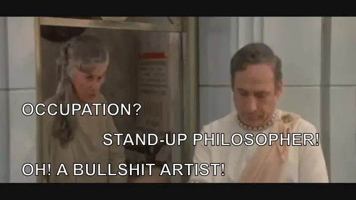

# Captioned Image - "Standup Philosopher"

## Preview

## Caption:

- **Bea:** Occupation?
- **Mel:** Standup Philosopher!
- **Bea:** Oh! A bullshit artist!

## About

This repository contains the sources for a captioned image. To view or
edit it type:

    inkscape ./Standup-Philosopher.svg

Image still ( `A-Standup-Philosopher-tl4VD8uvgec--vlcsnap-2020-12-26-16h57m39s657.png` ) taken
from https://www.youtube.com/watch?v=tl4VD8uvgec ( "Mel Brooks history of the world part 1
thanks Bea you will be missed" )

The final image can be viewed online here:

https://www.shlomifish.org/humour/image-macros/

## Creator

[Shlomi Fish](https://www.shlomifish.org/)

## Links

* [Discussion on /r/howyoudoin (= the subreddit about the Friends television show)](https://www.reddit.com/r/howyoudoin/comments/2i7ox2/as_a_woman_there_is_nothing_sexier_one_of_my_most/)
* [Link to context within my “So, who the Hell is Qoheleth?” illustrated screenplay](https://www.shlomifish.org/humour/So-Who-The-Hell-Is-Qoheleth/ongoing-text.html#celts_trip__non_seducable_jewish_merchants)
* [The One with the Fountainhead](https://www.shlomifish.org/humour/TOneW-the-Fountainhead/) - an older fanfic / crossover of *Friends*.
